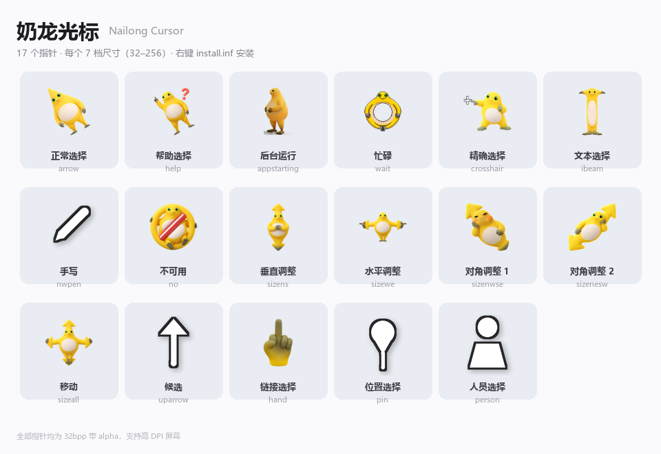

# 奶龙光标 · Nailong Cursor

一套奶龙主题的 Windows 鼠标指针。**13 款造型，覆盖 17 个系统指针槽位**（正常选择、文本选择、忙碌、链接选择……）。



MIT License · 下载即用，不需要装任何东西。

---

## 安装

**1. 下载**

点本页右上角绿色的 **`Code`** 按钮 → **`Download ZIP`**，然后解压。

> 也可以直接进 [`Cursors/`](Cursors) 目录，单独下载某个指针文件。

**2. 右键安装**

在解压出来的文件夹里，**右键 `install.inf` → 选择「安装」**。

弹出「用户账户控制」时点「**是**」—— 这一步要把指针文件复制到 `C:\Windows\Cursors\`，需要管理员权限，是正常现象。

**3. 选一下方案**

打开 **控制面板 → 鼠标 → 「指针」选项卡**（Win10/11 也可以：设置 → 蓝牙和其他设备 → 鼠标 → 其他鼠标选项 → 「指针」），
在「方案」下拉框里选 **`Nailong Cursor`** → 点「应用」→「确定」。

完成。

> **为什么装完没变化？** 第 2 步只是把方案*注册*进系统，第 3 步手动选一下才真正生效 ——
> 这是 Windows 指针方案的机制，所有指针主题包都是这个流程。
> 如果下拉框里找不到 `Nailong Cursor`，注销一次或重启资源管理器再看。

---

## 卸载

1. 控制面板 → 鼠标 → 指针 → 方案换成「Windows 默认（系统方案）」
2. 删掉 `C:\Windows\Cursors\Nailong Cursor\` 文件夹

---

## 文件说明

```
install.inf      右键 -> 安装（要跟 Cursors/ 放在一起）
Cursors/         17 个 .cur / .ani 指针文件
使用说明.txt     图文版安装步骤（同上面的「安装」）
预览.png         全部指针的实际观感
```

---

## 许可

MIT License，见 [LICENSE](LICENSE)。

奶龙（Nailong）形象仅作个人学习与二次创作展示，非官方周边。商用前请自行确认原角色版权归属。
